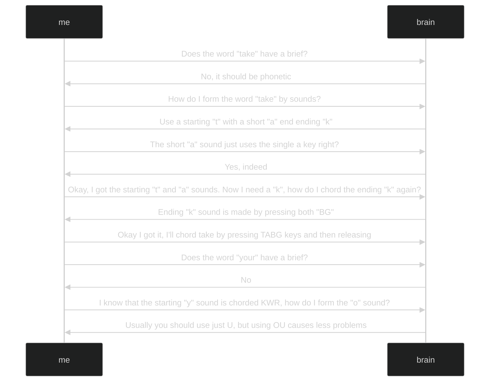

# My Journey Into Stenography

Let me share my empowering journey of how I discovered stenography.
I have been using steno for all my interactions with a computer for nearly a
year. I use steno for all my work as an embedded systems engineer and
anything else I do at a computer. Once you find the true power of stenography
offers compared to normal keyboard input, you can never to back.

## The Moment I First Heard Of Stenography And Plover

Soon after my second child's birth I was reading the monthly blog post from
[zsa](https://blog.zsa.io/2107-steno-tutorial/) while feeding the baby a bottle.
I had purchased a [moonlander keyboard](https://www.zsa.io/moonlander/)
earlier that year and had been enjoying reading updates shared in these monthly
blogs. Most articles discuss changes to their firmware builder web interface or
mention of adding some new feature. I was not expecting a fundamental change to
how I use a computer and would cause me to never use a normal keyboard again.



The life changing article titled
[Stenography with ZSA Keyboards: A Tutorial](https://blog.zsa.io/2107-steno-tutorial/)
by [Paul Fioravanti](https://www.paulfioravanti.com/). I love
tools and expanding my power user arsenal. I knew right away I needed to try
stenography. I'll share some quotes from the article that stuck out to me and my
thoughts on them.

> potential to supercharge your speeds past 200 (or even past 300!)
> words-per-minute:

This can't be possible right... How have I not heard of this before? Those
speeds seem unreal!

> Open up a text editor and press the steno E key (near your right thumb), and
> if it outputs “he”, then you have steno working! Try pressing some of the other
> keys, as well as chording some keys together, and see what output you get!

Wow! Words with single key presses? I did try this right away and found
instantaneous joy. It brought me a similar feeling as the first time I used a
microcontroler to blink and LED. Steno is such a different concept than typing
on a normal keyboard.

> Now comes the part that will involve a lot more time and effort: learning
> stenography.

This makes perfect sense, anything that contains true power take time and effort
to learn.

> Learning stenography feels more like learning a new language, rather than just
> a new keyboard layout, and so consequently it will likely take some time and
> practice before you start to reach a basic level of competency.

Nothing with this remark is to scare or mean it will be difficult . This is well
written advice and helps to set start expectations.

> I sincerely hope that this post has gotten you at least a bit steno-curious
> about the potential of using your ZSA keyboard beyond a standard QWERTY layout.

I'm more than a little curious... Where is my computer?? I watched the
video at the end and then reread the article over and over to make sure I
didn't his some important detail. It all seemed fanciful and incredible. I knew
I must get to work and learn more for myself.

## What Is It Like Learning Stenography?

Learning stenography takes work. The work of stenography is mental work. It
requires thought to type anything. There will be no muscle memory to lean on,
and it will take weeks or months before you may have the skill to type an entire
sentence without looking something up.

Since stenography uses methods such as phonetic phrasing and briefs to create
words it takes some thinking. Let me share some words and phrases and the
thoughts you'll need to process to write them.

To write the phrase `Take your vitamin` these consider these thoughts you may
have in an interview with your brain:

## How Stenography Can Create An Apex Power User

## What Can Stenography Do?

### Control Your Computer

### Programming With Stenography

### Oh, And Don't Forget The Obvious One... Writing Normal Text Fast

## Ergonomics And Your Health

