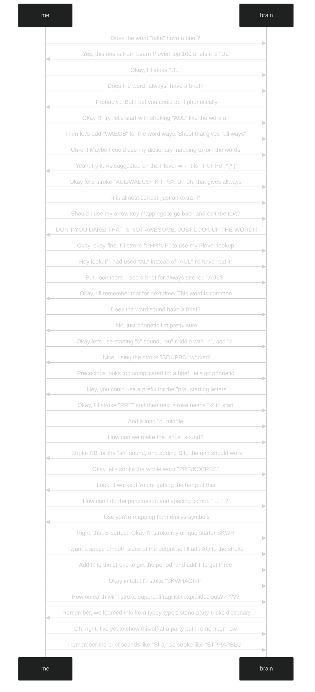

# My Journey Into Stenography

Let me share my empowering journey of how I discovered and embraced stenography.
I have been using steno for all my interactions with a computer for nearly a
year.

Exclusive use starting January 1st, 2022. Who says new years resolutions can't
work?

I use steno for all my work as an embedded systems engineer and anything else I
do at a computer. Once you find the true power of stenography offers compared to
normal keyboard input, you can never go back.

## The Moment I First Heard Of Stenography And Plover

Soon after my second child's birth I was reading the monthly blog post from
[zsa](https://blog.zsa.io/2107-steno-tutorial/) while feeding my son a bottle.
I had purchased a [moonlander keyboard](https://www.zsa.io/moonlander/)
earlier that year and had been enjoying reading updates shared in these monthly
blogs. Most articles discuss changes to their firmware builder web interface or
mention of adding some new feature. I was not expecting a fundamental change to
how I use a computer and would cause me to never use a normal keyboard again.

I couldn't wait for my son to finish this bottle so I could check this out.



The life changing article titled
[Stenography with ZSA Keyboards: A Tutorial](https://blog.zsa.io/2107-steno-tutorial/)
by [Paul Fioravanti](https://www.paulfioravanti.com/). I love
tools and expanding my power user arsenal. I knew right away I needed to try
stenography. I'll share some quotes from the article that stuck out to me and my
thoughts on them.

> potential to supercharge your speeds past 200 (or even past 300!)
> words-per-minute:

This can't be possible right... How have I not heard of this before? Those
speeds seem unreal!

> Open up a text editor and press the steno E key (near your right thumb), and
> if it outputs “he”, then you have steno working! Try pressing some of the other
> keys, as well as chording some keys together, and see what output you get!

Wow! Words with key chord presses? I did try this right away and found
instantaneous joy. It brought me a similar feeling as the first time I used a
microcontroler to blink and LED. Steno is such a different concept than typing
on a normal keyboard.

> Now comes the part that will involve a lot more time and effort: learning
> stenography.

This makes perfect sense, anything that contains true power take time and effort
to learn.

> Learning stenography feels more like learning a new language, rather than just
> a new keyboard layout, and so consequently it will likely take some time and
> practice before you start to reach a basic level of competency.

Nothing with this remark is to scare or mean it will be difficult . This is well
written advice and helps to set start expectations.

> I sincerely hope that this post has gotten you at least a bit steno-curious
> about the potential of using your ZSA keyboard beyond a standard QWERTY layout.

I'm more than a little curious... Where is my computer?? I watched the
video at the end and then reread the article over and over to make sure I
didn't his some important detail. It all seemed fanciful and incredible. I knew
I must get to work and learn more for myself.

## What Is It Like Learning Stenography?

Learning stenography takes work. The work of stenography is mental work. It
requires thought to type anything. There will be no muscle memory to lean on,
and it will take weeks or months before you may have the skill to type an entire
sentence without looking something up.

Since stenography uses methods such as phonetic phrasing and briefs to create
words it takes some thinking. Let me share some words and phrases and the
thoughts you'll need to process to write them.

To write the phrase `Take your vitamin` consider these thoughts you may
have in an interview with your brain:

(graphs made using [mermaid](https://mermaid-js.github.io/mermaid/#/flowchart))

To write the phrase `You'll always sound precocious ... supercalifragilisticexpialidocious`

Referenced links:

- [Plover retro actively delete space](https://github.com/openstenoproject/plover/wiki/Dictionary-Format#retroactively-delete-space)
- [typey-type steno-party-tricks dictionary](https://didoesdigital.com/typey-type/dictionaries/lessons/drills/steno-party-tricks/steno-party-tricks/)
- [emily-symbols](https://github.com/EPLHREU/emily-symbols)
- [my modded version of emily-symbols that affects spacing](https://github.com/derekthecool/PloverStenoDictionaries/blob/ffef83bd5177ef1d81063ed54ab3c0219108e047/plover/emily-symbols.py)

## What Can Stenography Do?

There are many everyday uses for stenography. In fact, the real question should
be why can't my qwerty keyboard do more?

You can use a steno keyboard for anything that you'd use a computer for. Here is
a list of things I use stenography for.

- Writing emails
- Writing code
- Opening programs on my computer
- And everything else that I need a computer for

### Control Your Computer

Steno should not be compartmentalized to just text fields. To truly unleash the
abillity to use steno exclusively and ditch using qwerty we need to control our
computers. If it becomes a burden to switch from your steno keyboard to your
mouse or to another keyboard find a way to do those tasks with steno.

If you are still using your mouse to close programs by pressing the little
button in the corner, STOP! Use a steno mapping for that. For example Windows
users could make a dictionary entry for `ALT+F4` to close the window your in.
Get creative!

One way to have more fine grained control over your computer window management
is to use a window manager. I personally use [workspacer](https://workspacer.org/quickstart/)
for Windows use and [AwesomeWM](https://awesomewm.org/index.html) for Linux.
While both of these work great upon first install, knowing the programming
language they are configured in helps. I happen to be lucky by already knowing
csharp and lua which are used in workspacer, and AwesomeWM.

I don't use mac, but a quick search engine result gave me a good
[reference](https://alternativeto.net/software/i3/?platform=mac) that
includes several viable options.

### Programming With Stenography

I plan to write many more articles about this. Speaking from over a year of
experience I can say this it is possible and it is glorious! I spend a lot of
time at my computer working on programming, using steno while I work has made
any wrist or arm pain disappear.

### Oh, And Don't Forget The Obvious One... Writing Normal Text Fast

This one cannot be left out. One great source of power from steno is the speed
it can offer. But I must say that my current speed is still not very high at
around 50 WPM. It is important to not get carried away by only caring about
speed.

### Spelling

I find the spelling benefits far out weigh the speed benefits. Not having to
worry if you put right amount Ls in the word `specifically` feels nice.
The spelling benefits are very noticeable with the single key briefs. It might
sound not very important, but I've never misspelled these words using steno:

- the
- and
- had
- he
- you

If you see someone misspell the word `the`, you may consider kindly
suggesting stenography to them.
